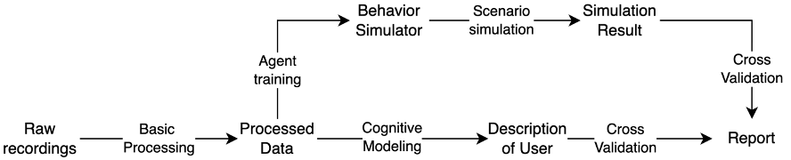
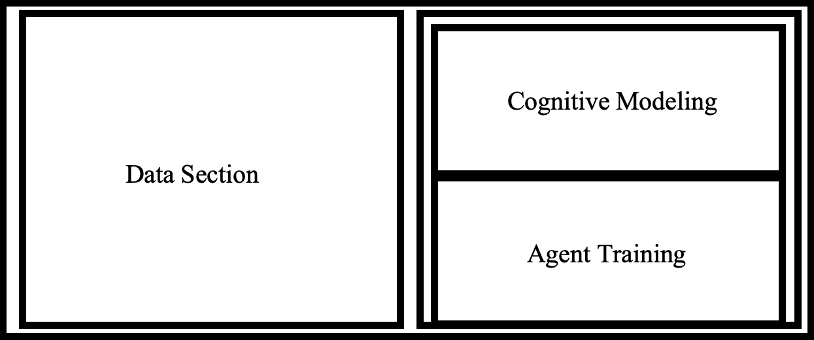
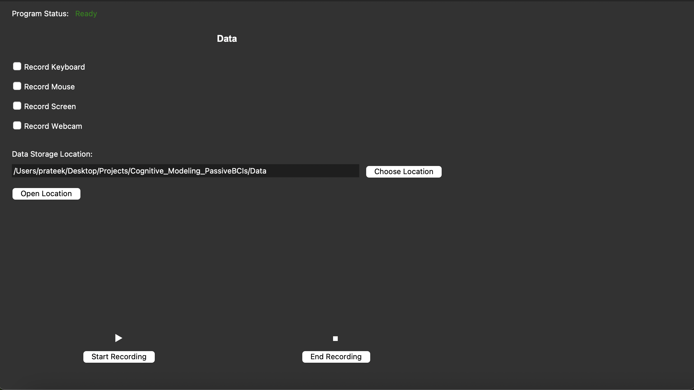
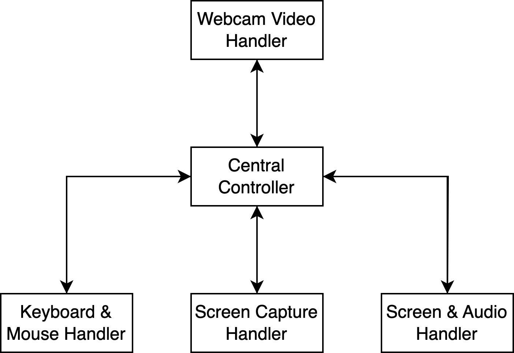

# Project Charter
_BUILDING AND SIMULATING FROM A COGNITIVE MODEL OF A PERSON USING PASSIVE BRAIN COMPUTER INTERFACES_

## Foreword

As my interests  amalgamate around working with human cognition and consciousness, I figured it was about time I started working on a serious project of my interest. I can read all I like, but if I am not able to demonstrate ability, I couldn’t imagine being accepted into a lab where I could get my PhD working on a project that genuinely interested me. I should try to aim for as high as I can, instead of trying to settle for less. That is the reason for this project. I have to promise myself to pursue it at all costs. Even if the final product (if there is ever a point where the project can be considered finished) is not what I originally set out to do.
I realize that embarking on this project will require to learn as I go. As I gain more insight and knowledge related to this rather ambitious project, its requirements and aim will become more precise. Expect the charter to be regularly updated and modified to reflect the most recent state of the project and its goal.

## Abstract

What I am attempting here is to build a software system that can model what it is like to be a specific person interacting with a computer, or more succinctly, a subject-specific cognitive emulator. Given real-world data produced from passive BCI techniques that comprise of
- Basic computer input streams 
    - Keystrokes
    - Cursor movements and clicks
- Visual representation of the user through the webcam
- Screen Content

all simultaneously captured, the ambitious me sets out two broad objectives for this project:

### 1. The learned moment-to-moment internal state of a user
This project will be to construct a representation of the user’s state of mind over time. Broadly, the following characteristics will be computed.

    - Working Memory
    - Stress Level
    - Attention
    - Emotional State

These markers will be analyzed after-the-fact, but any moment in the user's recording can be described by the above charactertistics in addition to an overall summary of the user.

A case can be made for fusing emotional state and stress level into a general affective state, but for now they will be kept distinct.

I believe it is possible to quantify each of the above characteristics, however, I am not sure as of yet what they will be. In any case, the reconstruction will then be cross-checked with the user’s own account of their state of mind over the same recorded period. Success will be measured in terms of how accurate the cognitive model developed is to the user’s own account, either mathematically or by qualitative judgement (it remains to be seen how exactly). Details on a precise metric will be determined later.

### 2. An artificial agent to simulate the user’s behavior from the user’s learned cognitive model
Using existing automation and simulation tools, such as Selenium for browsers and AutoHotKey on Windows, the idea is to be able to use the cognitive model learned over the course of the user’s recorded sessions to simulate the user’s most likely actions and behaviors when performing any specific computer task. It is intended to be generalized and even transferable from one computer task to another.

This too can be represented in terms of some measured characteristics, like words per minute, cursor speed, temporal variation in actions, and more, which at this time is yet to be decided. Like objective 1 above, accuracy is ultimately determined if the simulations are believed to be accurate to the user’s recorded sessions.

We are in effect using a modified version of the Turing test as the metric for success of the cognitive modeling. It may be the case that we use statistical representations, human inquiry, or machine learning systems, or even a combination of any two or all of these to make a conclusive statement.
The guiding principle will be seeking results that are good enough, not necessarily perfect or even close to perfect. This consideration mainly stems from the reality that I will have limited computing resources to spare for this project, which quickly seems to be becoming computationally expensive.

## Review of Existing Literature

### Cognitive Architectures

One of the components I will need is a **cognitive architecture**, which will serve as the virtual model of my human subject. I can either build this from the ground-up or repurpose a pre-existing one to suit my needs. It is very well likely that I build a sort of *Frankenstein* model that borrows from different cognitive architectures and other concepts (such as machine learning).

A cognitive architecture can be defined as the **framework for the functioning of a mind**. It provides a foundation for modeling knowledge, reasoning, skills, and other properties of a mind such as emotional state, stress, and focus—which I am trying to capture in conjunction.

#### Requirements for the Cognitive Architecture

1. **A dynamic memory system**  
   A memoryless system simply would not cut it. The system should be able to accept data and make judgements based on the cumulative meaning of the data. This requires some sort of data representation that can be altered over time, speaking of which...

2. **The ability to capture temporal relationships**  
   The data I will be capturing will be inherently temporal in nature; therefore, the architecture must be able to accommodate temporal relationships. Ideally, as time passes and more data is available, the system becomes more accurate.

3. **Modularity and Programmability**  
   A system is useless if its architecture is too rigid. Odds are, I will want to rework aspects of the architecture because I don’t expect any of them to perfectly fit my problem statement. Moreover, it should be malleable based on my own changing goals.

4. **Cognitive Validity**  
   This is really the bottom line. The architecture must be backed by some empirical findings or observations. Pure theorization is fun, but then I’d be taking shots in the dark. Bonus points if one of those empirical findings is BCI data.

#### Candidate Cognitive Architectures

The following were identified as cognitive architectures that seem usable at first glance. Any additional comments are not meant to show preference but simply outline something noteworthy:

1. **DAYDREAMER** – [GitHub Link](https://github.com/eriktmueller/daydreamer)

2. **LIDA** – Found at [https://ccrg.cs.memphis.edu/](https://ccrg.cs.memphis.edu/). This one attempts to incorporate the Global Workspace Theory of Consciousness.

3. **ACT-R** – Seems to be the most comprehensive and popular model to exist. *(Website down as of 05/17/2025)*

4. **CLARION** – [Project Page](https://sites.google.com/site/drronsun/clarion/clarion-project)

#### Honorable Mentions (Not Directly Suitable)

These architectures were not deemed fully suitable, but they may still serve as inspiration for certain aspects of the project:

1. **Semantic Pointer Architecture (SPA)**  
   This architecture attempts a more neurologically grounded approach. Specifically, its simplest unit is the neuron, and it uses a spiking neuron model. It describes function in the context of different brain regions.  
   It seems this architecture models very specific tasks and not general behavior, which is why it doesn’t ultimately pass—but modeling specific components of my system on neurologically plausible circuits would be worth considering.

2. **Psi-Theory**  
   A proposed unified theory of action, motivation, intent, and emotion. Critics state that it does not perform well in confirming experimental results in those domains and consists of many free variables left to the mercy of the programmer. It primarily yields qualitative predictions.  
   This is not a flaw in itself, but it would be preferable if I had quantitative results that I could label myself with qualitative distinctions.

3. **SOAR**  
   A tight rule-based cognitive task modeling architecture. It has a robust working memory system but is supposedly not as psychologically faithful as ACT-R, LIDA, or CLARION. However, it’s worth noting that this architecture purportedly shines in representing emotion and has accurately reflected the results of certain real-life human behavioral experiments.

> **ChatGPT’s recommendation:** Build your base on **LIDA** (due to alignment with your goals), borrow emotional modeling components from **Psi-Theory**, and draw structural inspiration from **ACT-R**, which is the most established—though most rigid—model.

---

### Contemporary Methods

Contemporary methods can be incorporated into my computational representation of a user and may, in fact, be more effective than the more esoteric and archaic cognitive architectures described above. That said, I would argue that by themselves, they do not specify *direction* in the project, which cognitive architectures generally do.

Specifically, I refer to modern-day **neural network-based statistical machine learning** and its derivatives. Of special interest would be **large language models** and **chain-of-thought reasoning**.

---

## Design Plan

### System Architecture

It is about time I provide a concrete description and series of requirements for the underlying system architecture of this project. By my current understanding, the pipeline looks something like the diagram below.

The two most challenging parts to this system are the **Cognitive Modeling** and **Agent Creation** phases. The former creates a representation of the user, which is [Objective 1](#1-the-learned-moment-to-moment-internal-state-of-a-user), and the latter will form the basis for accomplishing [Objective 2](#2-an-artificial-agent-to-simulate-the-users-behavior-from-the-users-learned-cognitive-model).

### User Interface

The program will exist with a GUI. It is from this GUI that one can record data, including all data-related configurations such as storage, deletion, etc, and trigger the cognitive modeling and agent training process. A very simple sketch of the GUI plan is shown below.

The current state of the UI is shown below:

### Data

The test subject will be myself. I will record my computer usage over at least one week. Usage can be captured independently of the rest of the system, which is to say, I don’t need my cognitive architecture ready before I collect data. The data can be collected with a much simpler application, and once the cognitive architecture is ready, I can test the system retroactively.

The following is a list of all the activity I intend to record.

1. **Keystrokes**  
   This refers to all the key presses by a user, irrespective of whether the user is typing or not. They will simply be recorded along with a timestamp of when they pressed that key.  
   A good way to represent this may be **sparse matrices** – time on the X-axis (rows) and each column representing a key.

   I imagine keystrokes will mainly provide insight into the **working memory** of the user, i.e., what is on their mind, as well as **explicit emotional state**. Alongside this, based on the temporal variations in typing behavior and speed, we may attempt to extract **level of focus** and **stress-level**.

2. **Cursor Activity**  
   This refers to the actions of the mouse cursor on the screen. It would record cursor movement — where it was at each time step. Mouse clicks and scrolls would also be recorded. 
   Once again, a matrix with time on the X-axis and the coordinates and mouse keys as columns.

   Cursor activity will go hand-in-hand with keystrokes. It will provide a glimpse into **working memory**, **level of focus**, and **stress-level**, derived from the specific content of cursor activity and the **temporal variations in usage patterns**.

3. **Webcam Recording**  
   The user will be recorded with a webcam. The recordings will be processed through some module such as **OpenCV**, which is already capable of identifying facial characteristics.  
   Specifically, we are interested in **general head movement**, **pupil movement**, and **facial expressions**.

   Webcam recordings will be used to determine **focus** from pupil and head movements, and **emotion** will be inferred from facial expression. It may also be possible to infer **stress** from facial expression, though that is not a priority at this time.

4. **Screen Content**  
   This wraps up and contextualizes the above three recorded activities. The idea is that, given the keystrokes, cursor activity, and even webcam recordings of the user, we need the **context** for the user’s actions and behavior.

   For this purpose, I have decided to **record** the user's screen. As with the webcam recording, some sort of computer vision module, like **OpenCV**, will play a role in trying to make sense of what is on the screen. There are other ways to capture information of screen content, but none of them are universal, and more importantly, reflective of what the user actually sees.

---

#### Data Recording Architecture

We will use **Pynput** to record keystrokes and mouse activity.

For screen recordings, we will use **mss** to take a screenshot and stitch together a recording using cv2's **VideoWriter**.

VideoWriter will also be used for webcam recordings, though each frame will be captured by cv2's **VideoCapture** class.

### Cognitive Model

The cognitive model is created from some specified cognitive architecture. I am still hazy on how this will materialize. The following are current ideas:

#### A. Repurpose Pre-existing Cognitive Architectures to Meet My Needs

This alludes to the current review of literature that exists. It is unlikely that any one architecture will suit my needs, so I will have to stitch aspects of different architectures together. There are two possible ways I can go about this:

**a. Use existing codebases implementing said architecture**  
Certain architectures have code implementations already available. The obvious benefit is that the heavy lifting of interpreting theory is lifted off my shoulders, and this should reduce how much time it takes to build the cognitive architecture. However, this is a double-edged sword.  
I am giving away top-down control by doing this and introducing rigidity that may prove difficult to work with, especially further down the line.  

Therefore, I will choose only those aspects of architectures that address my requirements *perfectly*, or *close to perfectly*. If the code for the architecture is easy to understand and modify, I will use those as well after editing as required.  
The preferred language is **Python**.

**b. Building a new cognitive architecture from scratch**  
If I decide to code from scratch, I will in effect be building my own cognitive architecture, albeit deriving significant inspiration from existing ones found in the review. This will naturally take more time, not to mention the technical challenges involved.  

Despite my confidence in myself, there may be times I’m at an impasse interpreting some literature—*if good literature exists at all*. However, the payoff is great: I will have not only produced a cognitive architecture that I have full control over, but I will have learned a great deal in the process.

#### B. Use a Machine-Learning Approach

Modern neural-network-based machine-learning algorithms have proven to be extremely effective at generating, inferring, and predicting from large amounts of data. I am unsure how this approach will fare.  
The major concern is **computational expense** and **demand for data**. I am also unsure how well this would capture the spirit of the project—i.e., there will be a disconnect between what the output is and how the system arrived at its output, regardless of how correct the output is.  

However, further literature review may resolve this. There are still more architectural considerations under this model. Specifically:

- What type of model(s) are we considering?
- How are we incorporating classical cognitive architecture theory?

The aim is for the cognitive architecture to satisfy **two purposes**:
1. The ability to demonstrate cognitive modeling as it is done in the brain.
2. The ability to accurately capture the **user’s specific traits**.

All of this must be achieved in the most **elegant** way possible.

The best course of action, I hypothesize, will be to model each measured trait—**emotional state**, **focus**, **stress**, and **working memory**—*separately* from shared inputs.  
Then, some sort of **meta-framework** will wrap all these characteristics neatly into one package. The architecture, then, becomes both:
- How individual traits are modeled
- How each of these sub-architectures come together

---

### Agent Creation

I do not need to address this section immediately, mainly because building a viable cognitive model as an objective comes *before* agent creation.

The simple idea, which is more of a placeholder currently, is that using the **same data** available for cognitive modeling, an **autonomous agent** will be created that should produce plausible behavior of the user in specific controlled scenarios that may or may not be related to scenarios the user was recorded in.
